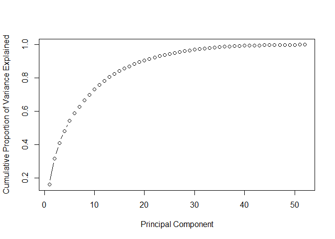

## Purpose
The goal of this project is to predict the manner in which study participant did exercise. This is the "classe" variable in the training set. The analysis uses Principal Component Analysis (PCA) coupled with a Random Forest model to generate a prediction algorith for a test set.  

## Load study data


```r
training <- read.csv("https://d396qusza40orc.cloudfront.net/predmachlearn/pml-training.csv")
quiz <- read.csv("https://d396qusza40orc.cloudfront.net/predmachlearn/pml-testing.csv")
train1 <- training[,c(2,8:11,37:49,60:68,84:86,102,113:124,140,151:160)]
quiz1 <- quiz[,c(2,8:11,37:49,60:68,84:86,102,113:124,140,151:160)]
```

## Split Training Data into Test / Train
The training data set has been split, with 70% of the data used to develop the algorith and 30% used to test the out of sample error. 


```r
library(caret)
```

```
## Loading required package: lattice
```

```
## Loading required package: ggplot2
```

```r
inTrain <- createDataPartition(y=train1$classe,p=0.7,list=FALSE)
train2 <- train1[inTrain,]
test2 <- train1[-inTrain,]
```

## Perform Dimension Reduction via PCA
53 variables is too many for an efficient Random Forest model, so PCA analysis was used to reduce the number of dimensions. 


```r
pca <- prcomp(train2[,2:53],scale=TRUE,retx=TRUE)
std_dev <- pca$sdev
var <- std_dev^2
prop_var <- var/sum(var)
plot(cumsum(prop_var),xlab = "Principal Component", ylab = "Cumulative Proportion of Variance Explained",type="b")
```

<!-- -->

```r
sum(prop_var[1:20])
```

```
## [1] 0.9061217
```
92% of variance is captured by the first 20 principal components. This is deemed satisfactory for the purposes of this report. 


## Combine Principal Components with Training Set

```r
train3 <- data.frame(classe = train2$classe,pca$x)
train3 <- train3[,1:21]
```

## Train Random Forest Model
Due to the 5 level classification of the output, a random forest model has been selected. To improve processing speed, the model training will utilise parallel processing and 5 folds / resampling iterations. 

The model has an accurary of 96% on the training data and this is deemed sufficient to proceed. 

```r
library(parallel)
library(doParallel)
```

```
## Loading required package: foreach
```

```
## Loading required package: iterators
```

```r
cluster <- makeCluster(detectCores()-1)
registerDoParallel(cluster)
fitControl <- trainControl(number=5,allowParallel = TRUE)
set.seed(5)
modelFit1 <- train(classe~.,data=train3,method="rf",trControl=fitControl)
stopCluster(cluster)
registerDoSEQ()
print(modelFit1)
```

```
## Random Forest 
## 
## 13737 samples
##    20 predictor
##     5 classes: 'A', 'B', 'C', 'D', 'E' 
## 
## No pre-processing
## Resampling: Bootstrapped (5 reps) 
## Summary of sample sizes: 13737, 13737, 13737, 13737, 13737 
## Resampling results across tuning parameters:
## 
##   mtry  Accuracy   Kappa    
##    2    0.9570346  0.9456866
##   11    0.9508892  0.9379087
##   20    0.9346068  0.9173116
## 
## Accuracy was used to select the optimal model using the largest value.
## The final value used for the model was mtry = 2.
```


## Transform Test data into PCA

```r
test3 <- predict(pca,newdata=test2)
test3 <- as.data.frame(test3)
test3 <- test3[,1:20]
```

## Prediction on Test data
The test partition data is used to assess the model fit. The out of sample accuary is 97%; this is higher than the training set and deemed sufficient to proceed. 

```r
testPredict <- predict(modelFit1, test3)
confusionMatrix(test2$classe,testPredict)
```

```
## Confusion Matrix and Statistics
## 
##           Reference
## Prediction    A    B    C    D    E
##          A 1661    2    4    5    2
##          B   22 1099   15    2    1
##          C    2   14  995   14    1
##          D    1    0   44  917    2
##          E    3    9    4    3 1063
## 
## Overall Statistics
##                                           
##                Accuracy : 0.9745          
##                  95% CI : (0.9702, 0.9784)
##     No Information Rate : 0.287           
##     P-Value [Acc > NIR] : < 2.2e-16       
##                                           
##                   Kappa : 0.9678          
##  Mcnemar's Test P-Value : 1.346e-06       
## 
## Statistics by Class:
## 
##                      Class: A Class: B Class: C Class: D Class: E
## Sensitivity            0.9834   0.9778   0.9369   0.9745   0.9944
## Specificity            0.9969   0.9916   0.9936   0.9905   0.9961
## Pos Pred Value         0.9922   0.9649   0.9698   0.9512   0.9824
## Neg Pred Value         0.9934   0.9947   0.9862   0.9951   0.9988
## Prevalence             0.2870   0.1910   0.1805   0.1599   0.1816
## Detection Rate         0.2822   0.1867   0.1691   0.1558   0.1806
## Detection Prevalence   0.2845   0.1935   0.1743   0.1638   0.1839
## Balanced Accuracy      0.9902   0.9847   0.9652   0.9825   0.9952
```

## Transform quiz data into PCA

```r
quiz3 <- predict(pca,newdata=quiz1)
quiz3 <- as.data.frame(quiz3)
quiz3 <- quiz3[,1:20]
```

## Prediction on quiz data

```r
quizPredict <- predict(modelFit1, quiz3)
quiz_answers <- as.data.frame(quizPredict)
print(quizPredict)
```

```
##  [1] B A B A A B D B A A B C B A E E A B B B
## Levels: A B C D E
```

The algorith correctly identified 19 out of 20 results in the quiz data, 95% accuracy. This is acceptable for the purpose of this report. 
